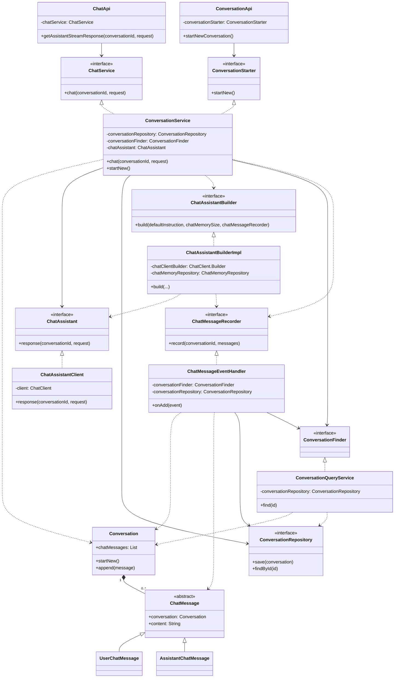
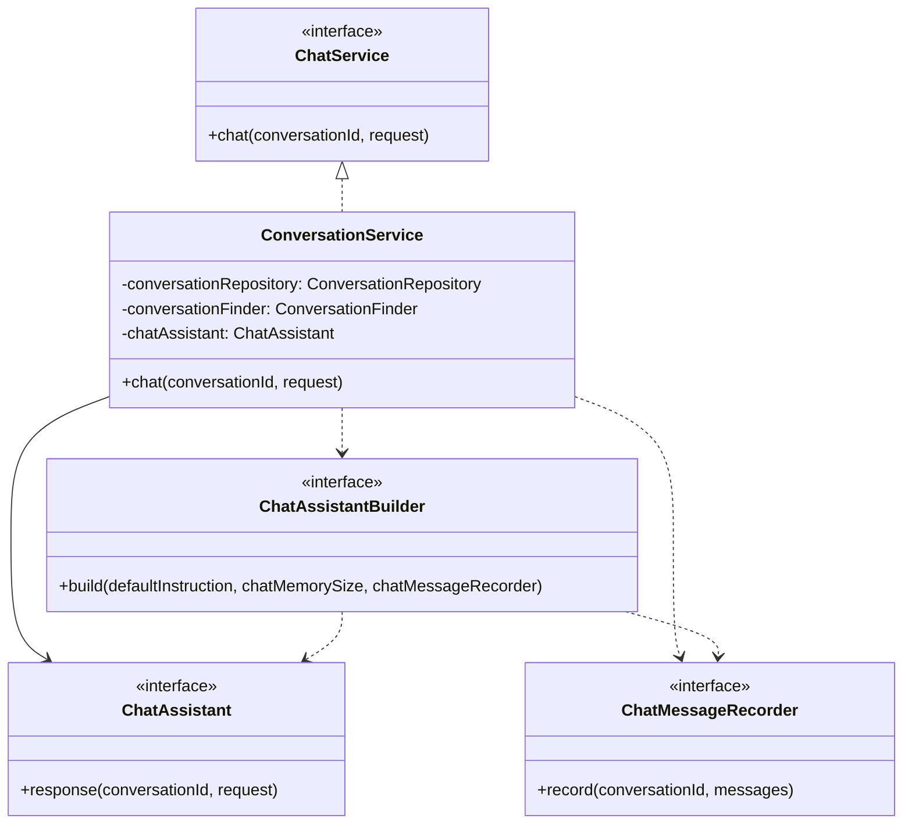

# 요구요구 (AI가 관리하는 요구사항명세서)

AI가 관리하는 요구사항명세서

#### 예시1

```text

사용자: 유저 요구사항을 추가해줘. 사용자는 10자의 닉네임을 가지고 이메일을 가지고 있어야해
AI: 알겠습니다. 유저(User) 도메인에 대한 요구사항 명세서를 작성하겠습니다. 기존에 검색된 문서가 없으므로 신규 문서를 생성하겠습니다. 


```

### 요구사항

- 사용자는 웹 기반의 대화창에서 AI와 대화가 가능하다.
- 클라이언트는 타임리프로 개발한다.
- 채팅경로는 /chat 으로 한다.
- 응답은 실시간으로 전송되며 응답 토큰의 최대크기를 2000 으로 한다.
- 지난 대화 기록을 기억한다.
- 채팅창에 프리셋된 프롬프트를 제시한다. \[
  '안녕? 자기소개해줘',
  '소프트웨어 개발의 "요구사항"이란 무엇인지 알려줘'
  ]

### 공부한 방법

#### Spring AI 레퍼런스 문서 원어로 읽기

https://docs.spring.io/spring-ai/reference/api/chatclient.html

#### 구현중 발생한 이슈를 해결하기 위해 GitHub Spring AI Repository 이슈에서 검색해서 읽기

https://github.com/spring-projects

#### 참고서적 읽기

- 최고의 프롬프트 엔지니어링 강의 - 김진중

### 용어정리

| 한글 : 영어          | 설명                               |
|------------------|----------------------------------|
| 채팅:Chat          | 사용자가 메세지를 주고 봇으로부터 응답을 받는 행위를 의미 |
| 대화:Conversation  | 도메인이며 여러 메세지를 가짐                 |
| 메세지:Message      | 여러 컨텐츠를 담을 수 있음을 암시              |
| 내부의 정보: Content  | 주로 메세지 안의 문자열 정보를 의미             |
| 사용자:User         |                                  |
| 봇:Assistant      |                                  |
| 연속됨, 실시간:Stream  | 챗봇의 응답은 주로 StreamResponse        |
| 응답을 받다: Response |                                  |
| 찾다:Find          | 없을 수도 있음                         |
| 가져오다:Require     | 없어서는 안됨                          |

### 클래스 설계



### 이슈노트

#### Spring AI 1.0의 자동구성 Bedrock VectorStore가 실행시 충돌.

##### f9659aedf8cde55de5890580fc385a3d135f5ded

##### 문제

```text
org.springframework.ai.vectorstore.pgvector.autoconfigure.PgVectorStoreAutoConfiguration required a single bean, but 2 were found:

- cohereEmbeddingModel: defined by method 'cohereEmbeddingModel' in class path resource [org/springframework/ai/model/bedrock/cohere/autoconfigure/BedrockCohereEmbeddingAutoConfiguration.class]

- titanEmbeddingModel: defined by method 'titanEmbeddingModel' in class path resource [org/springframework/ai/model/bedrock/titan/autoconfigure/BedrockTitanEmbeddingAutoConfiguration.class]
```

##### 원인

`org.springframework.ai:spring-ai-starter-vector-store-pgvector`가 `VectorStore`를 자동 구성 할 때 의존하는 임베딩 모델이 자동 구성시 두개가 동시에
등록됨

##### 해결

`BedrockCohereEmbeddingAutoConfiguration.class , BedrockTitanEmbeddingAutoConfiguration.class` 컨디셔널 빈 등록 조건을 보고 해당 프로퍼티를
추가하여 해결

```yaml
spring.ai.model.embedding=bedrock-titan
```

---

#### 스프링 AI Bedrock Converse Property를 IDE에서 인식하지 못함

##### 36bb7cbd87d3902df800605610f7476ee0998999

##### 문제

`spring.ai.bedrock.converse.chat.options.max-tokens` 의 프로퍼티를 resolve 하지못함

##### 원인

프레임워크의 관련 클래스가 인터페이스이고 구현체가 없어서 생긴 문제. 다만 런타임에 인식은 하는 상황
깃허브에 관련 이슈(https://github.com/spring-projects/spring-ai/issues/3620)가 등록되고 수정된 부분이 다음 버전에 머지된 것을 확인하였음.

---

#### AI의 스트림 응답을 클라이언트에서 처리할 때 생기는 어려움

##### 738d1e8bda08d9e8e2b6b5d84e551647f5bc5faa, b5e0e7e71f6bd90e4aa14b1e751cf12cadaea80d

##### 문제

봇의 응답을 스트리밍 하는 과정에서 SSE 방식으로 서버 측 컨텐츠 타입을 `text/event-stream`로 하여 구현을 시도했지만 클라이언트(Thymeleaf)에서 수신 데이터 형식
`data: {text} \\n\\n` 파싱의 어려움을 겪음 몇몇 응답에서는 `data: \\n data: \\n` 형식으로 오는 문제 발생. JS의 `fetch()`로는 이것을 구현하기가 복잡하였음

##### 고민

요청후 이벤트 수신을 받는 클라이언트 소스에서 JS의 `fetch()` , `eventSource()`를 조합하는 방식을 고려했으나 성격이 맞지 못했고. Microsoft의 Fetch-event-source
라이브러리를 도입할 것을 고려했으나 그것이 ESM이고 현재의 클라이언트(Thymeleaf) 환경에서는 자동빌드나 자동완성을 지원하지 않아서 보류함.

##### 해결

응답 컨텐츠 타입을 변경 `Content-Type: text/plain`. 서버 컨트롤러 메서드 리턴타입을 수정`Flux<String>`. 청크`Transfer-Encoding: chunked` 응답을 하도록
변경함. 클라이언트 소스에서는 `fetch()` 만 사용하여 응답 바디를 실시간으로 읽어 렌더링하는 방식으로 구현함

---

#### Spring AI 1.0 의 MessageChatMemoryAdvisor의 기본 구현이 AWS Bedrock API Spec에 충족하지 못함

##### 1364dbf5a28f5470fa6abb3c499845e5601052f7

##### 문제

```text
software.amazon.awssdk.services.bedrockruntime.model.ValidationException: A conversation must start with a user message. Try again with a conversation that starts with a user message. 
```

AWS bedrock LLM Model Nova Mirco API 사용시 요청문의 messages 리스트의 0번 객체가 UserMessage이지 않아서 요청이 거부된 문제가 발생함

##### 고민과 해결

제공되는 MessageChatMemoryAdvisor를 사용시 발생하는 문제이며 Spring AI Repository 의 버그 이슈로 등록된 것을
확인함(https://github.com/spring-projects/spring-ai/issues/2759)

`ChatMemory.maxMessages({size})`가 홀수인 경우 요청문의 첫번째 message 객체가 AssistantMessage가 들어가게 됨. 이를 짝수로 변경하여 회피하였음.

#### Spring AI 1.0 에서 대화기록을 저장할 기본 구현이 없음

##### 문제

`JdbcChatMemoryRepository`,`ChatMemory`의 기본 구현이 `ChatMemory.maxMessages({size})`크기를 제외한 나머지 ChatMemory를 초기화하므로 따로 대화 기록이
저장되지 않음

##### 고민과 해결

- 요구사항에 따라 응답이 클라이언트에게 실시간으로 전달되어야 했음. Spring AI는 ChatModel으로부터 전달받는 스트림인 Flux<String> 타입의 응답을 리턴하는데 이를 클라이언트에게 송신하면서
  기록도 할 수 있어야 했음.
- 먼저 [비공식 구현 사례](https://www.youtube.com/watch?v=85qxgRIEycY)를 학습하였음. 사례에서 제시한 방식은 ChatModel을 추상화한 ChatClient로부터 반환받은
  스트림을 관측하고 이를 기록하는 방식임. 처음에는 이 방식으로 구현하려고 했으나 의문이 듦.
- 이 방식대로라면 응답을 관측하고 기록하는 로직이 애플리케이션 서비스 메소드에 구현되어야 해서 나중에 구현로직이 변경된다면 서비스 메소드를 수정해야하는 유지보수 취약점이 있으리라 예상되었음.
- 그래서 이를 개선하기 위해서 서비스 메소드에서 ChatClient로 받은 스트림을 그대로 ChatRecord라는 커스텀 빈의 record(Flux<String> stream) 통해 기록로직을 처리한 스트림을
  반환하도록 구조개선을 시도하려고 했음.
- 개선 방식에도 몇가지 문제가 있음.
- SpringAI의 ChatMemory는 Advisor 통해서 대화기록을 프롬프트에 자동으로 탑재함. 따라서 ChatClient의 API를 사용할 때는 이러한 기록을 신경쓰지 않고 질의가 가능함. 즉
  ChatClient는 그 자체적으로도 추상화가 잘 되어있음.
- 그에 반해 대화기록 저장을 위해 ChatClient으로 전달받은 스트림을 서비스 단계에서 처리하는 것은 기본구현된 ChatMemory와 ChatHistory(대화기록)을 다른 추상화 레벨에서 관리한다는 말이며
  이는 각 레벨이 어긋나는 것이라고 생각됨.
- 따라서 ChatHistory는 ChatMemory ChatClient가 스트림을 반환하기 전에 처리되게끔 하는 것이 이상적으로 보였음.
- 이러한 구조 변화가 Spring AI의 세부 구현에 지나치게 영향을 받았기에 변화에 취약하다고 생각이 들기도 했음. 하지만 본 애플리케이션에서는 Spring AI를 프레임워크로 사용하기 때문에 이런 부분은
  부분적으로 감수될 수 있다고 생각되었음. 대신 최대한 구현로직을 인터페이스화 할 수 있는 것을 분리하도록 노력하였음
- 또한 ChatClient의 세부 API를 은닉하고 내부적으로 인터페이스를 통해 ChatClient API를 사용하는 것이 이상적으로 보였음.
- 따라서 ChatClient를 현 도메인 모델에 맞도록 추상화한 ChatAssistant 인터페이스를 만듦. declaration 은 다음과 같음

```java
package maskun.aimanagedsrs.hexagon.conversation.application;

public interface ChatAssistant {
    Flux<String> response(UUID conversationId, String request);
}

```

- 애플리케이션 서비스에서는 ChatAssistant을 구현한 빈의 메소드를 호출하는 것으로 다음과 같이 정리하였음.

```java
package maskun.aimanagedsrs.hexagon.conversation.application;

@Service
public class ConversationService implements ChatService {
    private final ConversationRepository conversationRepository;
    private final ConversationFinder conversationFinder;
    private final ChatAssistant chatAssistant;

    public ConversationService(
            ConversationRepository conversationRepository,
            ConversationFinder conversationFinder,
            ChatAssistantBuilder chatAssistantBuilder,
            ChatMessageRecorder chatMessageRecorder
    ) {
        this.conversationRepository = conversationRepository;
        this.conversationFinder = conversationFinder;

        final String defaultInstruction = "당신은 유능한 비서로 정확한 정보를 바탕으로 짧고 간결하게 대답합니다.";
        final int chatMemorySize = 4;
        this.chatAssistant = chatAssistantBuilder.build(defaultInstruction, chatMemorySize, chatMessageRecorder);
    }

    @Override
    public Flux<String> chat(UUID conversationId, String request) {
        conversationFinder.require(conversationId);
        return chatAssistant.response(conversationId, request);
    }

}
```

- ChatAssistant를 생성하는 로직은 사용되는 ChatClient가 SpringAI API에 의존하므로 이를 추상화한 인터페이스로 세부 구현을 다음과 같이 캡슐화하였음

```java
// 인터페이스
public interface ChatAssistantBuilder {
    ChatAssistant build(String defaultInstruction, int chatMemorySize,
                        ChatMessageRecorder chatMessageRecorder);
}

// 구현체
@Component
@RequiredArgsConstructor
public class ChatAssistantBuilderImpl implements ChatAssistantBuilder {
    private final ChatClient.Builder chatClientBuilder;
    private final ChatMemoryRepository chatMemoryRepository;

    @Override
    public ChatAssistant build(String defaultInstruction, int chatMemorySize,
                               ChatMessageRecorder chatMessageRecorder) {

        Assert.isTrue(chatMemorySize > 0, "chatMemorySize는 1 이상이어야 합니다");

        MessageWindowChatMemory chatMemory = MessageWindowChatMemory.builder()
                .chatMemoryRepository(chatMemoryRepository)
                .maxMessages(chatMemorySize)
                .build();

        ChatClient chatClient = chatClientBuilder
                .defaultSystem(defaultInstruction)
                .defaultAdvisors(
                        MessageChatMemoryAdvisor.builder(chatMemory).build(),
                        ChatMessageHistoryAdvisor.builder(chatMessageRecorder).build(),
                        new SimpleLoggerAdvisor()
                )
                .build();

        return new ChatAssistantClient(chatClient);
    }
}
```

- 위 인터페이스에서는 ChatAssistant를 생성할 때 호출자로부터 ChatMessageRecorder 빈을 전달받도록 설계하였음. 이는 ChatAssistant가 chat()을 할때 알아서 대화기록을
  저장한다는 것을 유추할 수 있도록 한 Declaration이었음.

- 마지막으로 이를 도식화한 설계도는 다음과 같음



- 그 밖의 세부 구현은 본 문서에는 생략하였음.

